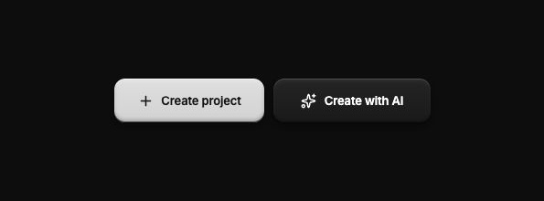
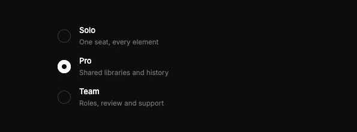
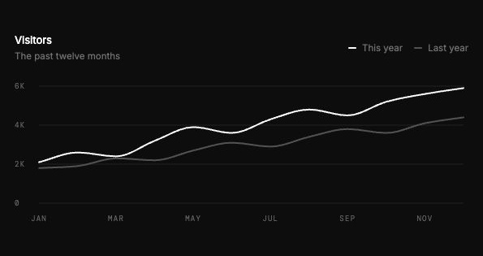
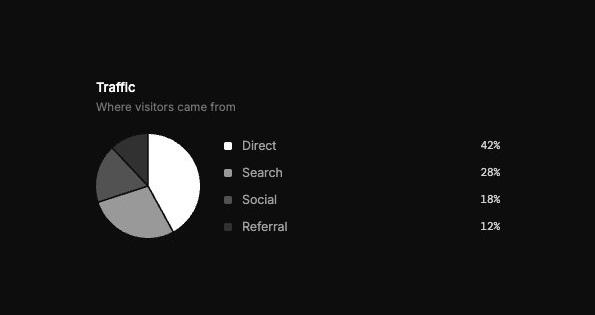

# Jimmy Wu's UI Kit

A quick starting point for a good-looking website.

This kit is not about making every website unique or cool. It gives you a
consistent visual foundation so you can start building quickly and spend your
time on the content, features, and interactions that matter.

Use it for a prototype, a small product, a dashboard, or an internal tool. It
includes React components, plain CSS, and a skill that teaches Claude Code and
Codex how to use the kit in your own projects.

The style is deliberately simple: dark surfaces, lit primary buttons, flat
controls, grayscale charts, and a small set of typography rules. You can adapt
the copy, colors, and layout to your project.

## A few elements

These are screenshots of the running demo.

| Buttons | Plan selector |
| --- | --- |
|  |  |

| Line chart | Pie chart |
| --- | --- |
|  |  |

The demo also includes cards, popups, toggles, text fields, segmented controls,
sliders, tabs, progress indicators, background patterns, and type specimens.

## 1. Set up your skill

On macOS or Linux, clone the repository to a location you plan to keep:

```sh
git clone https://github.com/JimmyWuReal/ui-kit.git
cd ui-kit
```

### Choose your own name

The default skill name is `ui-kit`. To use a custom name, open
[`skill/SKILL.md`](skill/SKILL.md) and change the `name` in its YAML frontmatter:

```yaml
name: my-ui
```

Keep the rest of the file. Use up to 64 lowercase letters, digits, and hyphens,
with no leading, trailing, or repeated hyphens. The installer reads this field,
so the installed directory and command name match. You can also change the
`display_name` in [`skill/agents/openai.yaml`](skill/agents/openai.yaml) to customize
the label in Codex's skill menu.

### Install and use it

Install for both apps:

```sh
sh scripts/install-skill.sh
```

Or choose one:

```sh
sh scripts/install-skill.sh claude
sh scripts/install-skill.sh codex
```

| App | Default installation directory | With the name `my-ui` |
| --- | --- | --- |
| Claude Code | `~/.claude/skills/<name>` | `/my-ui Build a settings page` |
| Codex | `~/.agents/skills/<name>` | `$my-ui Build a settings page` |

If you keep the default name, use `/ui-kit` in Claude Code or `$ui-kit` in Codex.
Restart an open session if the skill does not appear. Both apps can also select
it automatically when you ask to use Jimmy Wu's UI kit.

The installer creates symlinks to this checkout. Keep the **whole repository**
in place: the skill references the components and CSS in `src/`. You do not need
to install npm dependencies to use the skill. It is safe to rerun and refuses to
replace an existing skill.

If you rename an already installed skill or move its checkout, remove its old
symlinks before installing again. To update the kit, run `git pull --ff-only` in
the checkout; both apps use the updated files. Local edits to your skill name
are Git changes, so keep them when resolving any update conflicts.

The installer respects `CLAUDE_CONFIG_DIR` and `CODEX_HOME` when set. Override
specific skills directories with `UI_KIT_CLAUDE_SKILLS_DIR` or
`UI_KIT_CODEX_SKILLS_DIR`.

This setup works in local Claude Code sessions, including the Code tab in the
desktop app. Cowork and cloud sessions use separate installation mechanisms.
See the official [Claude Code skills documentation](https://code.claude.com/docs/en/skills)
and [Codex skills documentation](https://learn.chatgpt.com/docs/build-skills).

## 2. Start the demo site

Use Node.js 22.12 or newer. From the repository root:

```sh
npm ci
npm run dev
```

Open the local URL printed by Vite, usually `http://localhost:5173`. The demo has
three views: **Elements**, **Background**, and **Text**. Use an element's expand
button to inspect it, and try the background picker in the expanded view.

To build and preview the production version:

```sh
npm run build
npm run preview
```

The build is written to `dist/`.

## Use the kit in your project

Start with the skill's [element references](skill/SKILL.md#elements), then copy
the components and CSS you need. Controls and charts have named exports in
[`src/controls.jsx`](src/controls.jsx) and [`src/charts.jsx`](src/charts.jsx).
The demo uses React and `lucide-react`; charts use SVG. Adapt the chart demo data
to your own data and keep its accessible descriptions in sync.

The skill guides the design of your actual page. The demo gallery is there to
explore the elements.

## License

Open source under the [MIT license](LICENSE).
